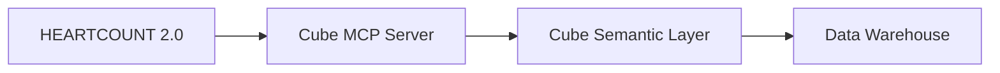
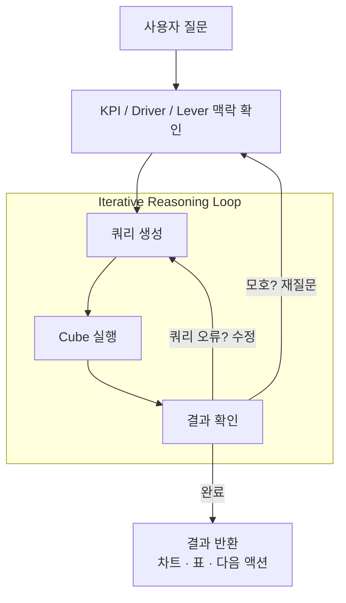

# Semantic Layer로 완성하는 Analytics Agent: SQL 생성부터 비즈니스 분석까지

자연어로 데이터를 조회하면 AI Agent는 조인 경로, 집계 수식, 필터 조건을 비즈니스 맥락 없이 한 번에 추론해야 합니다. 우연히 맞는 답이 나왔다 해도, 같은 질문에 항상 같은 결과를 보장하기 어렵습니다.

dbt Labs는 [Semantic Layer vs. Text-to-SQL: 2026 Benchmark Update](https://docs.getdbt.com/blog/semantic-layer-vs-text-to-sql-2026?version=1.12)에서 [data.world의 보험사 벤치마크](https://arxiv.org/pdf/2311.07509)를 Semantic Layer 방식으로 재현했습니다.


| 접근 방식                        | 정확도   |
| ---------------------------- | ----- |
| GPT-5.3 + DDL                | 84.1% |
| GPT-5.3 + dbt Semantic Layer | 100%  |


Semantic Layer가 AI Agent에 더 나은 인터페이스라는 점은 확인됩니다. 다만 이 실험은 지표(metric) 중심 질문에 한정됐고, 3-hop 이상의 복잡한 조인이 필요한 질문이나 집계 없는 목록 조회는 포함되지 않았습니다.

저희는 같은 데이터셋을 질문의 복잡도와 스키마의 복잡도를 기준으로 나눈 43개 질문으로 확장해 [Cube](https://cube.dev/) Semantic Layer로 5회씩 반복 실험했습니다.


|               | 스키마 복잡도 낮음 | 스키마 복잡도 높음 |
| ------------- | ---------- | ---------- |
| **질문 복잡도 낮음** | LQLS (12개) | LQHS (10개) |
| **질문 복잡도 높음** | HQLS (11개) | HQHS (10개) |


결과와 함께, 실험에서 발견한 한계를 HeartCount 2.0의 agentic flow로 어떻게 보완했는지 정리했습니다.

## Semantic Layer: AI Agent가 읽기 쉽게 구조화하기

Cube는 내부 데이터 모델을 정의하는 `cube`와, 이를 외부에 노출하는 `view`로 구성됩니다. 조인 경로, 집계 로직, 파생 지표 계산은 모델 내부에 숨기고, AI Agent에는 질문에 필요한 필드만 노출합니다.

```yaml
# claim.yml - cube 정의
cubes:
  - name: claim
    sql_table: claim

    joins:
      - name: claim_amount
        sql: "{claim}.claim_identifier = {claim_amount}.claim_identifier"
        relationship: one_to_many

    dimensions:
      - name: company_claim_number
        sql: company_claim_number
        type: string
        title: Claim Number

    measures:
      - name: claim_count
        sql: company_claim_number
        type: count
        title: Claim Count

      - name: avg_full_loss_amount
        sql: "{claim_amount.total_full_loss_amount} / NULLIF({claim_count}, 0)"
        type: number
        title: Avg Full Loss Amount per Claim
        description: "Average full loss (loss payment + loss reserve + expense payment + expense reserve) per claim."
```

```yaml
# ops.yml — view 정의
views:
  - name: ops
    cubes:
      - join_path: claim
        includes:
          - company_claim_number
          - claim_count
          - avg_full_loss_amount
```

join 로직과 집계 수식은 cube 안에 숨겨져 있습니다. `avg_full_loss_amount`는 내부적으로 `claim_amount`를 조인해 계산하지만, view는 그 구조를 알 필요 없이 필드 이름만 선언합니다. Agent도 마찬가지로 조인이 몇 단계인지 알 필요 없이, 노출된 필드 이름과 설명만 보고 쿼리를 만들면 됩니다.

```json
{
  "query": {
    "measures": ["ops.total_policy_amount"],
    "dimensions": ["ops.policy_number"],
    "filters": [
      {
        "member": "ops.party_role_code",
        "operator": "equals",
        "values": ["PH"]
      }
    ]
  }
}
```

이 구조 덕분에 AI Agent는 "어떻게 SQL을 짤 것인가"보다 "무엇을 조회할 것인가"에 집중할 수 있습니다.

## 실험 결과: Semantic Layer vs DDL


| 방식   | 실행 성공률 | Strict Exact |
| ---- | ------ | ------------ |
| Cube | 100%   | **76.3%**    |
| DDL  | 99.5%  | **35.3%**    |


실행 성공률은 두 방식 모두 높았습니다. 하지만 실행은 정확한 답을 보장하지 않습니다. DDL 방식에서는 에이전트가 조인 경로, 집계 수식, 필터 조건을 처음부터 추론해야 하지만 Cube는 앞서 본 것처럼 이 로직을 모델 안에 미리 정의해두기 때문에 에이전트는 어떤 필드와 조건을 쓸지에만 집중하면 됩니다.

좀 더 구체적으로 카테고리별로 확인해보겠습니다.

| 카테고리 | Cube Strict Exact | DDL Strict Exact |
| ---- | ----------------- | ---------------- |
| LQLS | 68.3%             | 35.0%            |
| LQHS | 58.0%             | 22.0%            |
| HQLS | 89.1%             | 54.5%            |
| HQHS | 90.0%             | 28.0%            |


질문 복잡도가 높은 쪽(HQLS 89.1%, HQHS 90.0%)이 낮은 쪽(LQLS 68.3%, LQHS 58.0%)보다 오히려 정확도가 높습니다. LQLS/LQHS에는 집계 없이 특정 값의 목록을 반환하는 차원 목록 질문이 집중된 반면, HQLS/HQHS는 집계 중심 질문이 많습니다. 질문 유형으로 나눠보면 차이가 명확합니다.


| 질문 유형 | Cube Strict Exact | DDL Strict Exact |
| ----- | ----------------- | ---------------- |
| 집계    | **89.5%**         | 41.9%            |
| 차원 목록 | **63.6%**         | 29.1%            |


집계 로직은 모델에 미리 정의되어 있어 에이전트가 틀릴 여지가 줄어듭니다. 반면 집계 없이 차원 목록만 조회하는 질문에서는 63.6%로 떨어졌는데, 실패한 유형은 크게 두가지입니다.

- dimension만 반환하면 되는 질문에 불필요한 measure를 추가하는 경우
- 필요한 dimension을 빠뜨리거나 measure/dimension 배치를 혼동하는 경우

## 정확한 조회, 그다음 문제

위 실험에서 DDL 대비 성능은 충분히 납득할 만합니다. 다만 Cube만 놓고 보면, 집계 질문에서 10%, 차원 목록 질문에서 36%가 여전히 틀립니다. 실제 비즈니스 질문에는 복잡한 분석뿐 아니라, 특정 조건에 맞는 데이터를 정확히 조회하는 단순 추출 작업도 많습니다. 

또 한가지는 SQL을 정확하게 생성하는 것이 분석 업무의 전부는 아니라는 겁니다. KPI가 왜 움직였는지, 관련 지표는 어떻게 변했는지, 그래서 어떤 조치를 해야 하는지까지 답하려면 단순 조회 이상의 맥락이 필요합니다.

Semantic Layer는 정확한 Analytics Agent를 만들기 위한 기초입니다. 하지만 목표는 단순한 데이터 조회에 머무르지 않습니다. 우리는 조회 결과를 실제 비즈니스 판단으로 연결할 수 있는 Analytics Agent로 발전시키고자 합니다.

이 문제는 크게 두 가지로 나눌 수 있습니다.

**절대적인 정확도가 아직 낮습니다.** `description` 같은 메타 정보를 구체적으로 작성할수록 정확도는 올라가지만, 그것만으로 충분하지 않습니다. 더 시스템적인 접근이 필요합니다. 우리는 이를 에이전트가 오류를 스스로 감지하고 재시도하는 루프를 통해 이 실패율은 줄이고자 합니다.

**숫자를 읽는 것만으로는 부족합니다.** 정확한 쿼리를 생성해 데이터를 조회하는 걸 넘어서 그 숫자가 왜 이런 값인지, 다음에 무엇을 보고 어떤 행동을 해야 하는지는가 궁금합니다. 이는 KPI 맥락, driver/lever 관계를 컨텍스트로 하여 해결하고 합니다.

## HeartCount 2.0의 Analytics Agent 구조

위 두 문제를 풀기 위해 HeartCount 2.0을 다음과 같이 설계했습니다.



### 기존 분석 맥락에서 출발

> **HeartCount 2.0 KPI 카드**

사용자는 빈 화면이 아니라 미리 정의된 KPI 목록에서 분석을 시작합니다. 덕분에 에이전트도 전체 데이터 웨어하우스 대신 이미 검증된 지표 집합 위에서 추론합니다.

KPI에 연결된 driver와 lever 정보는 "이 지표가 떨어지면 어떤 변수를 먼저 봐야 하는가"를 사전 정의합니다. 에이전트는 이 관계를 참고해 분석 경로를 좁힙니다.

### 더 정확한 쿼리를 위한 Agentic Loop

쿼리가 실패하면 MCP는 해당 오류를 에이전트에 전달합니다. 에이전트는 오류 메시지를 분석해 잘못된 필드나 조건을 수정한 뒤 다시 시도합니다. 질문이 모호한 경우에는 사용자에게 추가로 확인합니다.




예를 들어 measure/dimension 위치가 잘못된 경우 자동 보정 후 재실행하고, 존재하지 않는 필드를 요청하면 해당 view의 전체 필드 목록을 반환해 에이전트가 다시 선택할 수 있게 합니다.

### 비즈니스 인사이트로 이어지는 분석

HeartCount 2.0에서는 쿼리 조회 결과만 돌려주지 않습니다. 차트와 표를 함께 보여주고, driver/lever 기반의 다음 분석과 액션을 제안합니다. 사용자가 결과를 다른 도구로 옮기지 않아도 바로 검토하고, 다음 질문으로 이어갈 수 있습니다.

> **HeartCount 2.0 분석 결과 화면**
> driver/lever 기반 액션 제안 영역이 함께 보이는 화면

## 앞으로의 과제

지금 구조는 실제로 동작하지만, 아직 개선해야야 할 부분이 남아있습니다.

**시맨틱 레이어 자체가 노동집약적입니다.**
Cube, dbt Semantic Layer, LookML 모두 dimensions, measures, join 경로, 집계 로직을 수작업으로 정의해야 합니다. 스키마가 바뀌면 관련 정의도 함께 수정해야 하고, 잘못된 로직이 있어도 별다른 오류 없이 결과가 반환됩니다. [dbt 2025 설문](https://www.getdbt.com/resources/state-of-analytics-engineering-2025#download-the-report)에 따르면 AI 기반 데이터 질의 환경에서 시맨틱 레이어를 쓰는 곳은 3분의 1에 불과합니다. 나머지 3분의 2는 여전히 raw SQL 생성을 씁니다. "한 번 정의하면 어디서나"라는 약속과 달리, 실제로는 초기 구축, 유지보수, 마이그레이션에 드는 숨은 비용이 큽니다.

**비즈니스 맥락은 시맨틱 레이어 밖에서 관리해야 합니다.**  
팀마다 지표를 해석하는 방식이 다르고, 같은 KPI라도 상황에 따라 봐야 할 driver와 lever가 달라집니다. 이런 맥락을 semantic layer 안에 모두 넣으면 관리가 어려워지고 구조도 빠르게 복잡해집니다. KPI 정의와 분석 맥락은 협업하고 확장하기 쉬운 별도 구조로 관리해야 합니다.

벤치마크는 Semantic Layer가 AI Agent에 더 나은 데이터 인터페이스라는 점을 확인해줬습니다. HeartCount 2.0은 그 위에서 실제 비즈니스 분석 워크플로를 구현하려는 다음 단계의 시도입니다. 데이터 팀의 역할이 쿼리 작성에서 지표 정의와 분석 경로 설계로 이동하는 변화의 시작점이기도 합니다.

## 부록: 실험 설정
- **비교 대상**: Cube `/meta` 기반 JSON 쿼리 vs. 전체 PostgreSQL DDL 기반 SQL 생성
- **모델**: gpt-5.3-chat-latest, few-shot 예시 3개
- **반복 횟수**: 질문 43개, 각 5회 반복
- **평가 방식**: 실행 성공률, Strict Exact, Cell F1
- **Cube 모델**: 9개 기반 cube 위에 단일 public view

