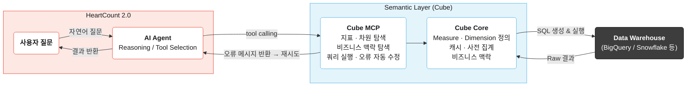
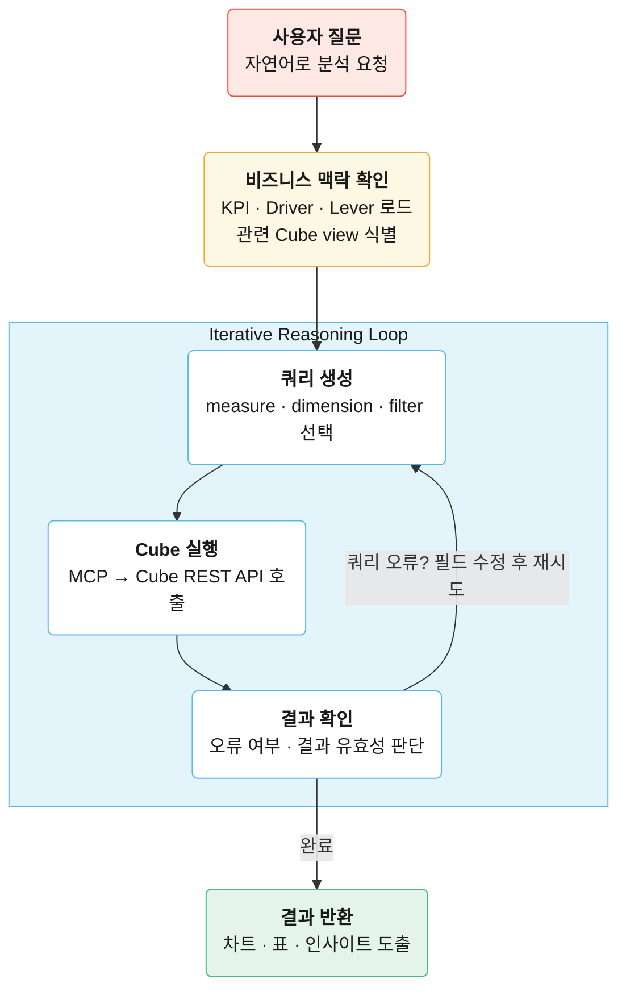

# Semantic Layer로 완성하는 AI Data Analyst: SQL 생성부터 비즈니스 인사이트까지

자연어로 데이터를 질의하는 AI Agent 환경이 빠르게 현실화되고 있습니다. 현재 가장 많이 논의되는 접근은 두 가지입니다. AI가 SQL을 직접 생성하는 Text-to-SQL, 그리고 비즈니스 로직을 미리 구조화해두는 Semantic Layer입니다.

다만 실제 분석 업무에서는 정확한 데이터 조회만으로는 충분하지 않습니다. 숫자 자체보다, 그 숫자가 왜 나왔는지, 어떤 의사결정으로 이어져야 하는지가 중요합니다.

저희는 이런 흐름을 지원하는 AI Data Analyst를 만들고 있습니다. 단순히 데이터를 조회하는 것을 넘어, 결과 해석과 원인 분석, 다음 행동까지 이어지는 분석 경험을 목표로 합니다.

이를 위해 Semantic Layer를 서비스 아키텍처에 적용했습니다. 이 글에서는 그 과정에서 확인한 실험 결과와, 실제 인사이트를 제공하기 위해 필요한 구조를 정리합니다.

## Semantic Layer vs Text-to-SQL

dbt Labs는 올해 [Semantic Layer vs. Text-to-SQL 벤치마크](https://docs.getdbt.com/blog/semantic-layer-vs-text-to-sql-2026?version=1.12)에서 이 문제를 직접 수치로 확인했습니다. 

해당 벤치마크에서는 데이터베이스 스키마 정보(DDL)를 바탕으로 SQL을 생성하는 Text-to-SQL 방식과, Semantic Layer를 활용하는 방식을 비교했습니다.

| 모델 | 접근 방식 | 정확도 |
| --- | --- | --- |
| GPT-5.3 | Text-to-SQL | 84.1% |
| GPT-5.3 | dbt Semantic Layer | 100% |

결과는 명확했습니다. 하지만 이 실험은 지표(metric) 중심 질문에 한정됐고, 3-hop 이상의 복잡한 조인이나 집계 없는 목록 조회는 포함되지 않았습니다. 실제 비즈니스 질문은 이보다 다양합니다.

같은 보험사 데이터셋을 [기존 논문](https://arxiv.org/pdf/2311.07509)의 분류 방식(질문 복잡도 × 스키마 복잡도)에 따라 43개 질문으로 구성하고, [Cube](https://cube.dev/)의 Semantic Layer로 5회씩 반복 실험했습니다.

|  | 스키마 복잡도 낮음 | 스키마 복잡도 높음 |
| --- | --- | --- |
| **질문 복잡도 낮음** | LQLS (12개) | LQHS (10개) |
| **질문 복잡도 높음** | HQLS (11개) | HQHS (10개) |

결과와 함께, 실험에서 발견한 한계를 HeartCount 2.0의 agentic flow로 어떻게 보완했는지 정리했습니다.

## Semantic Layer: AI Agent가 읽기 쉽게 구조화하기

Cube는 내부 데이터 모델을 정의하는 `cube`와, 이를 외부에 노출하는 `view`로 구성됩니다. 조인 경로, 집계 로직, 파생 지표 계산은 모델 내부에 숨기고, AI Agent에는 질문에 필요한 필드만 노출합니다.
데이터 모델은 집계 수치인 Measure(청구 건수, 평균 손실금 등)와 분류 속성인 Dimension(청구 번호, 병원 등급 등)으로 구성됩니다.

```yaml
# claim.yml - cube 정의
cubes:
	- name: claim
		sql_table: claim
	
	joins:
		- name: claim_amount
			sql: "{claim}.claim_identifier = {claim_amount}.claim_identifier"
			relationship: one_to_many
	
	dimensions:
		- name: company_claim_number
			sql: company_claim_number
			type: string
			title: Claim Number
	
	measures:
		- name: claim_count
			sql: company_claim_number
			type: count
			title: Claim Count
	
		- name: avg_full_loss_amount
			sql:"{claim_amount.total_full_loss_amount} / NULLIF({claim_count}, 0)"
			type: number
			title: Avg Full Loss Amount per Claim
			description: "Average full loss (loss payment + loss reserve + expense payment + expense reserve) per claim."
```

```yaml
# ops.yml — view 정의
views:
	- name: ops
		cubes:
	- join_path: claim
		includes:
			- company_claim_number
			- claim_count
			- avg_full_loss_amount
```

join 로직과 집계 수식은 Cube 안에 숨겨져 있습니다. 예를 들어 `avg_full_loss_amount`는 내부적으로 `claim_amount`를 조인해 계산하지만, view는 그 구조를 알 필요 없이 필드 이름만 선언합니다. Agent도 마찬가지로 조인이 몇 단계인지 알 필요 없이, 노출된 필드 이름과 설명만 보고 쿼리를 만들면 됩니다.

```json
{
  "query": {
    "measures": ["ops.total_policy_amount"],
    "dimensions": ["ops.policy_number"],
    "filters": [
      {
        "member": "ops.party_role_code",
        "operator": "equals",
        "values": ["PH"]
      }
    ]
  }
}
```

이 구조 덕분에 AI Agent는 “어떻게 SQL을 짤 것인가”보다 “무엇을 조회할 것인가”에 집중할 수 있습니다.

## 실험 결과

평가 지표는 실행 성공률(쿼리가 오류 없이 실행됐는지)과 Strict Exact(결과 셀 값이 정답과 완전히 일치하는지)를 기준으로 삼았습니다.

| 모델 | 방식 | 실행 성공률 | Strict Exact |
| --- | --- | --- | --- |
| GPT-5.3 | Text-to-SQL | 99.5% | **35.3%** |
| GPT-5.3 | Cube Semantic Layer | 100% | **76.3%** |

실행 성공률은 두 방식 모두 높았습니다. 하지만 실행은 정확한 답을 보장하지 않습니다. Text-to-SQL 방식에서는 에이전트가 조인 경로, 집계 수식, 필터 조건을 처음부터 추론해야 하지만 Semantic Layer는 앞서 본 것처럼 이 로직을 모델 안에 미리 정의해두기 때문에 에이전트는 어떤 필드와 조건을 쓸지에만 집중하면 됩니다.

좀 더 구체적으로 카테고리별로 확인해보겠습니다.

| 카테고리 | Cube Strict Exact | DDL Strict Exact |
| --- | --- | --- |
| LQLS | 68.3% | 35.0% |
| LQHS | 58.0% | 22.0% |
| HQLS | 89.1% | 54.5% |
| HQHS | 90.0% | 28.0% |

질문이 복잡할수록 오히려 정확도가 높습니다. HQLS 89.1%, HQHS 90.0%인 반면, LQLS 68.3%, LQHS 58.0%입니다. LQLS/LQHS는 집계 없이 특정 값의 목록을 반환하는 질문이 집중된 반면, HQLS/HQHS는 집계 중심 질문이 많기 때문입니다. 질문 유형으로 나눠보면 차이가 명확합니다.

| 질문 유형 | Cube Strict Exact | DDL Strict Exact |
| --- | --- | --- |
| 집계 | **89.5%** | 41.9% |
| 차원 목록 | **63.6%** | 29.1% |

집계 로직은 모델에 미리 정의되어 있어 에이전트가 틀릴 여지가 줄어듭니다. 반면 집계 없이 차원 목록만 조회하는 질문에서는 63.6%로 떨어졌는데, 실패한 유형은 크게 두 가지입니다.

- dimension만 반환하면 되는 질문에 measure를 추가하는 경우
- 필요한 dimension을 빠뜨리거나 measure/dimension 배치를 혼동하는 경우

## 정확한 조회, 그다음 문제

Text-to-SQL 대비 Semantic Layer의 성능은 충분히 납득할 만합니다. 다만 Semantic Layer만 놓고 보면, 집계 질문에서 10%, 차원 목록 질문에서 36%가 아직 틀립니다. 두 가지 문제가 남아 있습니다.

**정확도를 더 높여야 합니다.** `description` 같은 메타 정보를 구체적으로 작성할수록 정확도는 올라가지만, 그것만으로는 충분하지 않습니다. 에이전트가 오류를 스스로 감지하고 재시도하는 루프가 필요합니다.

**데이터 조회가 분석의 끝이 아닙니다.** KPI가 왜 움직였는지, 다음에 무엇을 봐야 하는지, 어떤 의사결정이 필요한지까지 답하려면 단순 조회 이상의 비즈니스 맥락이 필요합니다.

## HeartCount 2.0의 Analytics Agent 구조

위 두 문제를 풀기 위해 HeartCount 2.0을 다음과 같이 설계했습니다. 핵심은 두 가지입니다.

하나는 비즈니스 맥락을 미리 구조화한 것입니다. [실무에서 분석은 대부분 새로운 탐색이 아니라 기존 지표를 들여다보는 작업의 반복입니다](https://medium.com/@AnalyticsAtMeta/inside-metas-home-grown-ai-analytics-agent-4ea6779acfb3). 에이전트도, 데이터 소비자도 빈 화면이 아니라 검증된 지표에서 출발합니다. 특정 지표가 왜 움직였는지, 어떤 변수를 먼저 확인해야 하는지가 미리 정의되어 있어, 에이전트는 데이터 웨어하우스 전체를 탐색하는 대신 좁혀진 분석 경로를 따라 추론합니다.

다른 하나는 Cube MCP(Model Context Protocol)를 통한 쿼리 실행 루프입니다. 쿼리가 실패하면 MCP는 오류 메시지를 에이전트에 돌려주고, 에이전트는 잘못된 필드나 조건을 수정해 다시 시도합니다. 사람이 개입하지 않아도 스스로 보정하는 구조입니다.



### 기존 분석 맥락에서 출발

.png)

사용자는 미리 정의된 KPI 목록에서 분석을 시작합니다. 지표를 선택하면 에이전트는 해당 KPI에 연결된 비즈니스 맥락을 함께 로드합니다. "이 지표가 떨어지면 어떤 변수를 먼저 봐야 하는가"가 사전 정의되어 있어, 에이전트는 데이터 웨어하우스 전체를 탐색하는 대신 검증된 분석 경로를 따라 추론합니다. 각 KPI에 연결된 지표는 Cube의 사전 집계(pre-aggregation)로 미리 계산해두어, 쿼리 시점에 원본 데이터를 다시 집계하지 않고 빠르게 결과를 반환합니다.

### 더 정확한 쿼리를 위한 Agentic Loop

쿼리가 실패하면 MCP는 해당 오류를 에이전트에 전달합니다. 에이전트는 오류 메시지를 분석해 잘못된 필드나 조건을 수정한 뒤 다시 시도합니다.



예를 들어 measure/dimension 위치가 잘못된 경우 자동 보정 후 재실행하고, 존재하지 않는 필드를 요청하면 해당 view의 전체 필드 목록을 반환해 에이전트가 다시 선택할 수 있게 합니다.

agentic loop를 벤치마크에 적용했을 때, **LQLS는 68.3%에서 91.7%로, LQHS는 58.0%에서 70.0%로 올랐습니다**. 

LQHS가 덜 오른 건 비즈니스 맥락이 충분하지 않았기 때문입니다. `has_premium = 1`처럼 필드 이름만 봐선 알 수 없는 조건은 description에 비즈니스 맥락이 담겨 있다면 에이전트가 더 정확하게 추론할 수 있습니다.

### 비즈니스 인사이트로 이어지는 분석

HeartCount 2.0은 조회된 수치를 비즈니스 목표와 연결해 해석하고, 다음에 봐야 할 분석과 액션까지 함께 제안합니다.

"이번 달 과지급율이 어떻게 됐어?"라는 질문에 5.7%를 반환하는 데서 그치지 않습니다. 목표 초과 여부, 전월 대비 추세, 처리 지연보다 심사 품질 문제일 가능성까지 해석하고, 고위험 병원등급 × 비급여항목처럼 먼저 좁혀야 할 구간을 구체적으로 짚어줍니다.

이런 분석 경로는 KPI마다 미리 정의된 driver/lever 구조를 따릅니다. 에이전트는 이 맥락을 참고해 추가 쿼리를 실행하고, 각 근거 쿼리를 결과 문장에 직접 연결합니다.

.png)

.png)

## 실험에서 얻은 것들

**Semantic Layer는 인터페이스의 문제입니다** 
DDL 대비 정확도 차이(76.3% vs 35.3%)는 모델 성능 차이가 아닙니다. 에이전트가 "어떻게 SQL을 짤 것인가"를 고민하지 않아도 되는 구조가 만들어낸 차이입니다. 특히 집계 질문에서 89.5% vs 41.9%로 격차가 벌어진 건, 집계 로직이 모델 안에 미리 정의되어 있어 에이전트가 틀릴 여지 자체가 줄었기 때문입니다.

**에이전트의 정확도는 비즈니스 맥락이 결정합니다**
필드 이름만으로 의미를 추론할 수 없는 조건이 반복적으로 실패했습니다. 모델이 좋아져도 이 한계는 달라지지 않습니다. 비즈니스 맥락이 있어야 에이전트가 정확하게 추론할 수 있고, 그 맥락을 얼마나 잘 구조화하느냐가 정확도와 인사이트를 결정합니다.

**Agentic Loop는 선택이 아닙니다**
LQLS가 68.3%에서 91.7%로 오른 건 모델을 바꾼 게 아니라 Agentic Loop를 붙인 결과입니다. 한 번의 쿼리로 정답을 내는 건 현실적이지 않습니다. 실패를 감지하고 스스로 수정하는 구조가 없으면 정확도는 일정 수준에서 멈추게 됩니다.

**빠르게 만들고, 실제로 써봐야 압니다**
벤치마크 설계부터 HeartCount 2.0 구현까지 한 달이 걸렸습니다. 짧은 시간이었지만, 실제로 써보기 전까지는 보이지 않던 문제들이 있었습니다. 비즈니스 맥락이 정확도를 결정한다는 것, agentic loop 없이는 일정 수준에서 정확도가 멈춘다는 것 모두 실험을 통해 확인했습니다.

## 앞으로의 과제

지금 구조는 실제로 동작하지만, 아직 개선해야 할 부분이 남아있습니다.

**시맨틱 레이어 자체가 노동집약적입니다.**
Cube, dbt Semantic Layer, LookML 모두 dimensions, measures, join 경로, 집계 로직을 수작업으로 정의해야 합니다. 스키마가 바뀌면 관련 정의도 함께 수정해야 하고, 잘못된 로직이 있어도 별다른 오류 없이 결과가 반환됩니다. [dbt 2025 설문](https://www.getdbt.com/resources/state-of-analytics-engineering-2025#download-the-report)에 따르면 AI 기반 데이터 질의 환경에서 시맨틱 레이어를 쓰는 곳은 3분의 1에 불과합니다. 나머지 3분의 2는 여전히 raw SQL 생성을 씁니다. “한 번 정의하면 어디서나”라는 약속과 달리, 실제로는 초기 구축, 유지보수, 마이그레이션에 드는 숨은 비용이 큽니다.

**비즈니스 맥락은 시맨틱 레이어 밖에서 관리해야 합니다.**
팀마다 지표를 해석하는 방식이 다르고, 같은 KPI라도 상황에 따라 봐야 할 비즈니스 맥락이 달라집니다. 이런 맥락을 semantic layer 안에 모두 넣으면 관리가 어려워지고 구조도 빠르게 복잡해집니다. KPI 정의와 분석 맥락은 협업하고 확장하기 쉬운 별도 구조로 관리해야 합니다.

벤치마크를 통해 Semantic Layer가 AI Agent에 더 나은 데이터 인터페이스라는 점을 확인했습니다. HeartCount 2.0은 그 위에서 실제 비즈니스 분석 워크플로를 구현하려는 다음 단계의 시도입니다. 데이터 팀의 역할이 쿼리 작성에서 지표 정의와 분석 경로 설계로 이동하는 변화의 시작점이라고 생각합니다.

## 부록: 실험 설정

- **비교 대상**: Cube [`/meta`](https://cube.dev/docs/product/apis-integrations/javascript-sdk/reference/cubejs-client-core#meta-1) 기반 JSON 쿼리 vs. 전체 PostgreSQL DDL 기반 SQL 생성
- **모델**: gpt-5.3-chat-latest, few-shot 예시 3개
- **반복 횟수**: 질문 43개, 각 5회 반복
- **평가 방식**: 실행 성공률, Strict Exact
- **Cube 모델**: 9개 기반 cube 위에 단일 public view